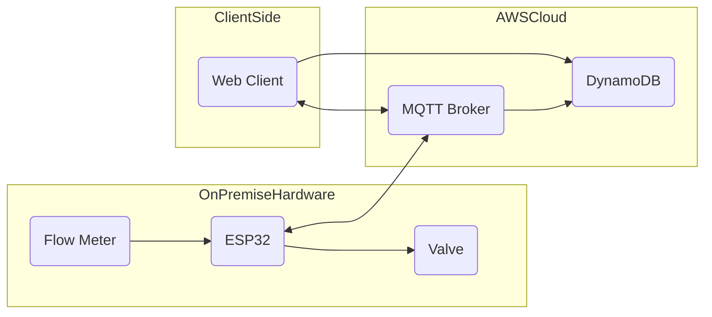

TODO:
- [ ] Calibration
- [ ] Graph data from Dynamodb
- [ ] Graph data from MQTT
- [ ] Valve control

TODO (aspirational):
- [ ] aws CI/CD with actions
- [ ] remote deployment to end device?

```mermaid
flowchart LR
    subgraph OnPremiseHardware
        ESP32(ESP32)
        FlowMeter(Flow Meter)
        Valve(Valve)
        FlowMeter --> ESP32
        ESP32 --> Valve
    end

    subgraph AWSCloud
        MQTTBroker(MQTT Broker)
        DDB(DynamoDB)
        MQTTBroker --> DDB
    end
    
    subgraph ClientSide
        WebClient(Web Client)
    end

    ESP32 <--> MQTTBroker
    WebClient --> DDB
    WebClient <--> MQTTBroker

``` 
